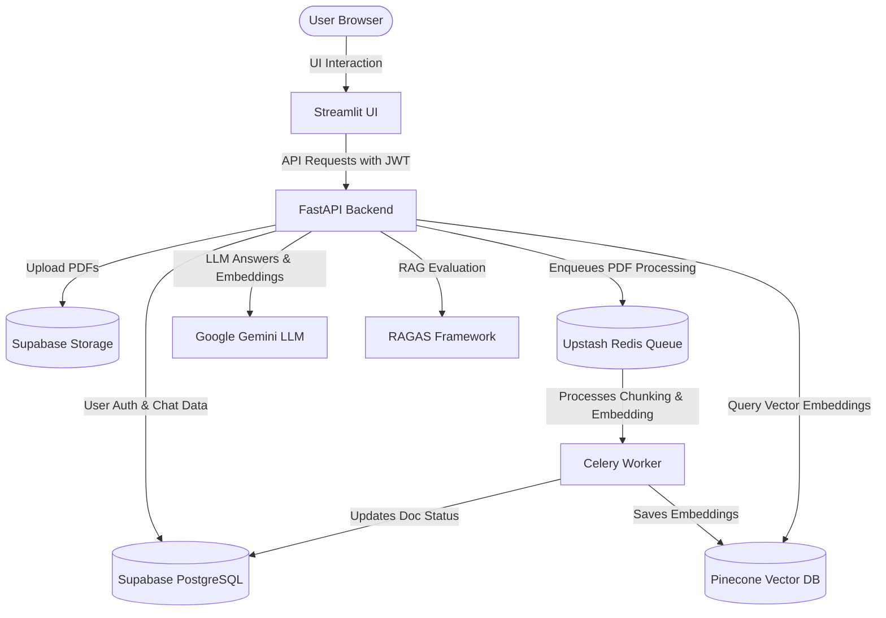
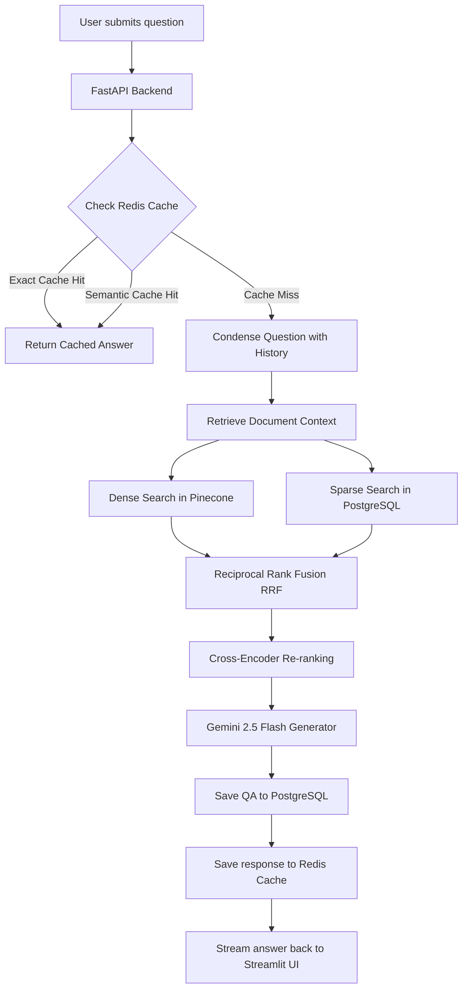
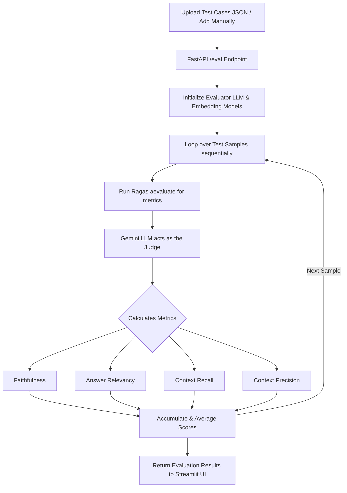

# 📚 AskDocX : Production-Grade RAG System
A modular, production-ready RAG chatbot and evaluation backend featuring FastAPI, Streamlit, Celery, Supabase, Pinecone, and Upstash Redis. 

> *Extension to the initial RAG Chatbot project: https://github.com/vasug27/Document_Chatbot*

---

## 📌 Table of Contents
- [✅ Overview & Key Features](#-overview--key-features)
- [🛠️ Architecture Design](#️-architecture-design)
- [🛠 Tech Stack](#-tech-stack)
- [🧠 Key System Components](#-key-system-components)
- [📁 Folder Structure](#-folder-structure)
- [⚙️ Setup & Credentials Guide](#️-setup--credentials-guide)
- [🚀 Usage Guide / How to Use](#-usage-guide--how-to-use)
- [🔐 Environment Variables](#-environment-variables)
- [💬 Chat Execution Flow](#-chat-execution-flow-with-redis-caching)
- [📊 RAGAS Evaluation Flow & Metrics](#-ragas-evaluation-flow--metrics)
- [🗄️ Relational Database Schema](#️-relational-database-schema)
- [📌 Backend API Routes](#-backend-api-routes)
- [📜 Chat History & Rephrase Features](#-chat-history--rephrase-features)
- [🛡️ Multi-Tenant Vector Design](#️-multi-tenant-vector-design-pinecone)
- [📄 Ingestion & Evaluation Optimizations](#-ingestion--evaluation-optimizations)
- [🧹 Operations & Database Administration Guide](#-operations--database-administration-guide)
- [🤝 Contributing](#-contributing)
- [🧑 Author](#-author)

---

## ✅ Overview & Key Features

AskDocX is a production-grade **Retrieval-Augmented Generation (RAG) system** built to handle high-concurrency document querying, multi-user isolation, and automated evaluations.

### 🌟 Core Features
- **🔒 Secure Authentication:** Multi-user support featuring JSON Web Tokens (JWT) and Bcrypt secure password hashing.
- **💬 Isolated Multi-Session Chats:** Create, switch, and maintain multiple concurrent chat sessions with document-scoped query focus.
- **⚡ High-Performance Document Ingestion:** Fast PDF parsing via PyMuPDF (fitz) coupled with asynchronous Celery background workers.
- **🛡️ Tenant Isolation & Metadata Filtering:** Strict user-level vector query isolation in Pinecone to prevent cross-user data leakage.
- **🚀 Hybrid Search & RRF:** Combines dense Pinecone embeddings with local PostgreSQL BM25 sparse search using Reciprocal Rank Fusion (RRF) and Cross-Encoder re-ranking.
- **🧠 Intelligent Query Caching:** Dual-layered Upstash Redis exact matching and embedding-based semantic caching to drastically cut LLM execution costs.
- **📈 Advanced RAG Evaluation:** Built-in RAGAS automated evaluations (Faithfulness, Answer Relevancy, Context Recall/Precision) using Gemini as a judge.

---

## 🛠️ Architecture Design



---

## 🛠 Tech Stack

| Category         | Technologies Used |
|------------------|--------------------|
| Frontend App     | Streamlit |
| Backend Server   | FastAPI, Uvicorn |
| Database         | Supabase PostgreSQL |
| Vector Database  | Pinecone |
| Cache & Message Queue | Upstash Redis |
| Worker Process   | Celery |
| Ingestion Parser | PyMuPDF (fitz), LangChain Text Splitters |
| AI Frameworks    | LangChain, Google Generative AI (Gemini 2.5 Flash), Ragas |
| Security         | PyJWT, bcrypt |

---

## 🧠 Key System Components

*   **FastAPI Backend:** Serves as the core REST API engine, orchestrating user accounts, routing queries, checking caches, querying vector stores, and serving streaming server-sent responses.
*   **Streamlit Frontend:** Implements the chat workstation UI, dashboard authentication tabs, active document management sidebar, and interactive RAGAS evaluations console.
*   **Supabase PostgreSQL:** Acts as the primary transactional database, maintaining schemas for users, document processing statuses, chat sessions, and message logs.
*   **Supabase Storage:** Serves as the file persistence layer, holding original uploaded PDF documents securely.
*   **Upstash Redis:** Serves a dual purpose: acts as the ultra-fast exact & semantic cache (reducing LLM costs) and coordinates Celery worker task queues.
*   **Celery Worker:** Executes non-blocking background workers to download, extract, split, embed, and upsert PDF document structures to Pinecone.
*   **Pinecone Vector Database:** Powers the dense semantic search indexing, retrieving document context chunks scoped securely via tenant metadata filters.
*   **Ragas:** Operates as the LLM-as-a-judge evaluation suite, calculating production metrics (Faithfulness, Relevancy, Recall, and Precision) on RAG query-answer pairs.

---

## 📁 Folder Structure

```
├── .gitignore
├── .env
├── README.md
├── requirements.txt
├── schema.sql
├── Dockerfile                 # Docker build definition for containerized deployments
├── render.yaml                # Render Blueprint specification for single-service deployment
├── run.sh                     # Shell startup script for multi-process container orchestration
├── app.py                     # Streamlit Frontend application
├── main.py                    # FastAPI Backend API Server
├── worker.py                  # Celery background PDF ingestion worker
├── auth.py                    # JWT authentication & password hashing logic
├── database.py                # SQL database setup and models
├── storage.py                 # Supabase Storage PDF buckets controller
├── pinecone_service.py        # Pinecone Vector Store initialization & query engine
├── cache_manager.py           # Upstash Redis Exact & Semantic caching controller
├── evaluate_rag.py            # RAGAS metrics evaluator engine (with sleep throttle)
├── evaluate_pipeline_batch.py # Command-line local batch evaluator utility
├── test_gemini.py             # Simple diagnostic script to verify Gemini API Key
├── ragas_eval_sample.json     # Sample RAGAS evaluation test cases JSON file
└── venv/                      # Python local virtual environment
```

---

## ⚙️ Setup & Credentials Guide

Follow these steps to set up the databases, keys, and services across all cloud providers:

### 1️⃣ Google AI Studio (Gemini Key)
1. Go to [Google AI Studio](https://aistudio.google.com/).
2. Click **Create API Key** and generate a key.
3. Add it to your `.env` as `GEMINI_API_KEY`.
*(Note: If using the free tier, requests are capped at 15 RPM and 20 RPD. Link a billing card to AI Studio to unlock unlimited pay-as-you-go limits).*

### 2️⃣ Supabase (PostgreSQL & Storage Bucket)
1. Sign up and create a project on [Supabase](https://supabase.com/).
2. Under Settings ➡️ Database, copy your **Connection string (URI mode)**. Set this as `DATABASE_URL` in `.env`.
3. In the Supabase **SQL Editor**, paste the contents of the `schema.sql` file and execute the queries to initialize the tables.
4. Go to **Storage**, create a new bucket named `documents`, and toggle its setting to **Public**.
5. Copy your project **URL** and **anon/service_role API Key** under Settings ➡️ API. Save these as `SUPABASE_URL` and `SUPABASE_KEY` in `.env`.

### 3️⃣ Pinecone (Vector Store)
1. Sign up on [Pinecone](https://www.pinecone.io/).
2. Create an API Key in the Pinecone Console. Set this as `PINECONE_API_KEY` in `.env`.
3. Set `PINECONE_INDEX_NAME` in `.env` as `askdocx`.
*(Note: You do not need to create the index manually. The backend automatically initializes a Serverless index on AWS `us-east-1` with Cosine similarity and 3072 dimensions during the first PDF upload).*

### 4️⃣ Upstash (Redis Cache & Queue)
1. Sign up on [Upstash](https://upstash.com/).
2. Create a new Redis database.
3. Under Database details, copy the **Redis URL** connection string (using the SSL version: `rediss://...`). Set this as `REDIS_URL` in your `.env`.

### 5️⃣ Run Services Locally
```bash
# Clone and enter directory
git clone https://github.com/vasug27/Production-Level-RAG.git
cd Production-Level-RAG

# Setup virtual environment
python -m venv venv
.\venv\Scripts\activate      # Windows Powershell

# Install requirements
pip install -r requirements.txt

# Start services (run in separate terminals or as background tasks)
uvicorn main:app --reload --host 0.0.0.0 --port 8000                   # 1. FastAPI Backend
streamlit run app.py                                                   # 2. Streamlit UI

# 3. Start Celery Worker(s) (Choose Option A or Option B below)
```

#### 📦 Celery Worker Execution Options:

##### **Option A: Resource-Isolated (Recommended to prevent large PDF bottlenecks)**
Run these two commands in separate terminal sessions to ensure small PDFs are never blocked behind large PDF queues:
```bash
# Terminal A (Light PDF Queue - processes PDFs up to 100 pages with concurrency of 2)
celery -A worker.celery_app worker --loglevel=info -Q light-pdf -P threads -c 2

# Terminal B (Heavy PDF Queue - processes PDFs above 100 pages with concurrency of 1)
celery -A worker.celery_app worker --loglevel=info -Q heavy-pdf -P threads -c 1
```

##### **Option B: Single-Worker (Simpler, but small files could wait behind heavy ones)**
Run a single worker process listening to both queues:
```bash
celery -A worker.celery_app worker --loglevel=info -Q light-pdf,heavy-pdf -P threads -c 3
```

> 💡 **Note on Celery Windows Execution (`-P threads`):** 
> * **`-P threads`:** Celery's default `prefork` process pool is not supported/stable on Windows. We use thread-based execution pool (`threads`) to ensure local execution compatibility.
> * **`-c`:** Configures task concurrency to run task threads in parallel, optimizing background document embedding ingestion without resource exhaustion.


---

## 🚀 Usage Guide / How to Use

Follow this workflow to use the RAG System:

1. **User Accounts & Sign In:**
   - Open Streamlit (http://localhost:8501).
   - In the sidebar, select the **Authentication** tab.
   - Enter your email and password to **Sign Up** (first-time users) or **Log In**. A secure JWT token will be generated to keep your sessions private.

2. **Ingest Documents:**
   - Navigate to the **RAG Chatbot** tab.
   - Drag and drop your PDF files into the file uploader.
   - Celery background workers will automatically download, chunk, and embed your PDF (routing small PDFs to the `light-pdf` queue and large ones to the `heavy-pdf` queue).
   - You can monitor the ingestion status in the sidebar (indicated by ⏳ for processing, 🟢 for completed, 🔴 for failed).

3. **Start a Chat Session:**
   - In the **Chat Sessions** panel on the left, type a session name (e.g., "Resume Analysis") and click **➕ Create Session**.
   - Select the checkbox next to the completed documents (marked with 🟢) you want to query against. Only the selected documents will form the context for the model.

4. **Ask Questions:**
   - Type your question in the query input field and hit enter.
   - The application will check the Redis cache first, perform hybrid search (dense Pinecone + sparse PostgreSQL) on the selected documents, rephrase the query for historical accuracy, and stream the response to you.

5. **Run RAGAS Evaluations:**
   - Switch to the **RAGAS Evaluations** tab in the sidebar.
   - Upload a JSON file containing evaluation test cases. You can use the pre-configured sample file **[ragas_eval_sample.json](file:///c:/Development/Document_Chat_LLM/Document_Chatbot/ragas_eval_sample.json)** in the project root folder.
   - Click **Run Evaluation**. The backend will sequentially evaluate your RAG system using Gemini as a judge and display scores for Faithfulness, Answer Relevancy, Recall, and Precision.

---

## 🔐 Environment Variables (`.env`)

| Key                  | Description                                            |
|----------------------|--------------------------------------------------------|
| `GEMINI_API_KEY`     | Google AI Studio Gemini API Key                        |
| `DATABASE_URL`       | Supabase PostgreSQL Connection String (URI mode)       |
| `SUPABASE_URL`       | Supabase project API endpoint URL                      |
| `SUPABASE_KEY`       | Supabase project service_role/anon API key             |
| `SUPABASE_BUCKET_NAME` | Supabase storage bucket name (e.g. `documents`)      |
| `PINECONE_API_KEY`   | Pinecone Vector Database API Key                       |
| `PINECONE_INDEX_NAME`| Pinecone Index Name (defaults to `askdocx`)            |
| `REDIS_URL`          | Upstash Redis connection string (`rediss://...` SSL)   |
| `JWT_SECRET_KEY`     | Access Token encryption secret for user authentication |

---

## 💬 Chat Execution Flow (With Redis Caching)

When a user submits a prompt, the query is resolved through the following caching, retrieval, and generation path:



---

## 📊 RAGAS Evaluation Flow & Metrics

### **Evaluation Execution Flow**

Evaluations are triggered from the Streamlit UI, routed to the FastAPI backend, and executed sequentially over your test cases:



### **⚡ RAGAS Evaluation Demo Guide**

We have prepared a sample RAGAS evaluation test suite to verify the performance of the RAG pipeline.

#### **Step 1: Upload the Context Document**
1. Log in to the application at **`https://askdocx-app-o3z5.onrender.com`**.
2. Upload the **`QuantumDynamics Inc. Annual Financial and Strategic Report`** PDF in the documents panel on the left sidebar.
3. Check the checkbox next to the uploaded document to select it as the active context source.

#### **Step 2: Load the RAGAS Test Suite**
1. Switch to the **RAGAS Evaluation** tab in the main header of the workspace.
2. Under **RAG Pipeline Tester**, click the upload box and select the **`ragas_eval_sample.json`** file from the project directory.
3. The dashboard will show: `✓ Suite loaded: 1 samples`.

#### **Step 3: Run the Assessment**
1. Click the **Run RAGAS Assessment** button.
2. The backend will sequentially evaluate the test sample against the 4 core RAGAS metrics in a background threadpool to prevent API timeouts.
3. The evaluation takes about **20–30 seconds** for 1 sample.

#### **Step 4: View the Results**
Once the evaluation completes, the dashboard will display the generated scores:
*   **Faithfulness (`1.000`):** Indicates perfect groundedness in the source document.
*   **Answer Relevancy (`0.881`):** Measures how well the pipeline answers the target question.
*   **Context Recall (`1.000`):** Verifies that the retriever retrieved all facts required.
*   **Context Precision (`1.000`):** Confirms the correct pages were retrieved at high rank.

---

### **Core RAGAS Metrics Explained**

AskDocX integrates the industry-standard **Ragas Framework** to measure four vital dimensions of RAG pipelines:

1. **Faithfulness (Factuality):**
   * **Simple Explanation:** Checks if the chatbot's answer is strictly based on your uploaded documents. It makes sure the bot doesn't make up (hallucinate) any fake facts.
   * **How it works:** It breaks down the chatbot's answer into separate statements and verifies if each statement is backed up by your document text.

2. **Answer Relevancy:**
   * **Simple Explanation:** Checks if the chatbot directly answered your question, instead of rambling about unrelated topics or giving generic answers.
   * **How it works:** It measures how closely the generated response aligns with the core question you asked.

3. **Context Recall (Completeness):**
   * **Simple Explanation:** Checks if the retrieval system successfully found all the right information in your documents needed to answer the question.
   * **How it works:** It checks if all key facts from the correct ground truth answer are present in the retrieved document text.

4. **Context Precision (Retrieval Quality):**
   * **Simple Explanation:** Checks if the most relevant parts of the document were retrieved and ranked at the very top of the search results, keeping noise out.
   * **How it works:** It looks at the retrieved document chunks and penalizes cases where useless chunks are ranked higher than relevant ones.

---

## 🗄️ Relational Database Schema

### **Database Diagram**

```
    ┌───────────────┐
    │     users     │
    ├───────────────┤
    │ id (PK, UUID) │◄────────┐
    │ email         │         │
    │ password_hash │         │
    │ created_at    │         │
    └───────────────┘         │
            ▲                 │
            │                 │
    ┌───────┴───────┐   ┌─────┴─────────┐
    │   documents   │   │ chat_sessions │
    ├───────────────┤   ├───────────────┤
    │ id (PK, UUID) │   │ id (PK, UUID) │◄────────┐
    │ user_id (FK)  │   │ user_id (FK)  │         │
    │ filename      │   │ title         │         │
    │ storage_url   │   │ created_at    │         │
    │ status        │   └───────────────┘         │
    │ created_at    │                             │
    └───────────────┘                     ┌───────┴───────┐
                                          │ chat_messages │
                                          ├───────────────┤
                                          │ id (PK, BIGINT│
                                          │ session_id(FK)│
                                          │ role          │
                                          │ content       │
                                          │ created_at    │
                                          └───────────────┘
```

### Table DDL Specifications

```sql
-- Enable UUID extension
CREATE EXTENSION IF NOT EXISTS "uuid-ossp";

-- 1. Users Table
CREATE TABLE users (
    id UUID PRIMARY KEY DEFAULT uuid_generate_v4(),
    email VARCHAR(255) UNIQUE NOT NULL,
    password_hash VARCHAR(255) NOT NULL,
    created_at TIMESTAMP WITH TIME ZONE DEFAULT CURRENT_TIMESTAMP
);

-- 2. Documents Table
CREATE TABLE documents (
    id UUID PRIMARY KEY DEFAULT uuid_generate_v4(),
    user_id UUID REFERENCES users(id) ON DELETE CASCADE,
    filename VARCHAR(255) NOT NULL,
    storage_url TEXT NOT NULL,
    status VARCHAR(50) DEFAULT 'processing',
    created_at TIMESTAMP WITH TIME ZONE DEFAULT CURRENT_TIMESTAMP
);

-- 3. Chat Sessions Table
CREATE TABLE chat_sessions (
    id UUID PRIMARY KEY DEFAULT uuid_generate_v4(),
    user_id UUID REFERENCES users(id) ON DELETE CASCADE,
    title VARCHAR(255) NOT NULL,
    created_at TIMESTAMP WITH TIME ZONE DEFAULT CURRENT_TIMESTAMP
);

-- 4. Chat Messages Table
CREATE TABLE chat_messages (
    id BIGSERIAL PRIMARY KEY,
    session_id UUID REFERENCES chat_sessions(id) ON DELETE CASCADE,
    role VARCHAR(50) NOT NULL,
    content TEXT NOT NULL,
    created_at TIMESTAMP WITH TIME ZONE DEFAULT CURRENT_TIMESTAMP
);
```

---

## 📌 Backend API Routes

### 👤 **Auth & User Routes**

| Method | Endpoint | Description |
|--------|----------|-------------|
| POST | `/signup` | Register a new user |
| POST | `/login` | Authenticate user and issue JWT token |

### 💬 **Chat Session Routes**

| Method | Endpoint | Description |
|--------|----------|-------------|
| GET | `/sessions` | Fetch all chat sessions created by active user |
| POST | `/sessions` | Create a new named chat session |
| GET | `/sessions/{session_id}/messages` | Fetch chat history messages for a specific session |

### 📄 **Document Management Routes**

| Method | Endpoint | Description |
|--------|----------|-------------|
| GET | `/documents` | Fetch status of all uploaded files for active user |
| POST | `/upload` | Upload PDF context file to Supabase Storage & trigger worker |

### 🤖 **RAG Queries & Evaluation Routes**

| Method | Endpoint | Description |
|--------|----------|-------------|
| POST | `/chat/query/stream` | Ask a question (checks cache ➡️ retrieves from Pinecone ➡️ streams Gemini answer) |
| POST | `/eval` | Run RAGAS pipeline evaluation asynchronously over user-defined cases |

---

## 📜 Chat History & Rephrase Features

The application incorporates a robust history tracking and context reconstruction workflow:

*   **Multi-Session History Isolation:** Chat sessions are separated programmatically. Chat histories are saved in the chat_sessions and chat_messages PostgreSQL tables, partitioned strictly by session ID.
*   **Dynamic Chat History Re-Loading:** When switching between active sessions in the Streamlit sidebar, the app requests all previous exchanges from the /sessions/{session_id}/messages endpoint to rebuild the local chat window.
*   **LLM History Context Window:** During QA queries, the FastAPI backend retrieves the last 3 exchanges (6 messages total) from PostgreSQL to provide context for the active session.
*   **Core Question Rephrasing:** Using a dedicated prompt chain (rephrase_chain), the backend takes the active history and the user's latest question to reconstruct a standalone, context-complete query. This standalone query is what is evaluated against the caches and vector database, preventing search dilution from pronouns (e.g. "what is its revenue?").
*   **Per-Session Exact Cache (Redis Caching):** When a query is answered, the response is stored in Redis under the key `cache:{session_id}:{query}`. Repeating the exact same question in that session pulls the answer instantly from Redis, bypassing both the database and the Gemini API.

---

## 🛡️ Multi-Tenant Vector Design (Pinecone)

To guarantee that users can never access or query each other's uploaded document data, each chunk's embedding contains metadata attributes. 

### Chunk Metadata Structure
When a background worker embeds document chunks, it saves the following JSON metadata structure alongside the vector in Pinecone:

```json
{
  "user_id": "9b1deb4d-3b7d-4bad-9bdd-2b0d7b3dcb6d",
  "document_id": "7a3ce098-cdb9-43c2-bf72-8f5b4a53df8a",
  "filename": "annual_financial_report_2025.pdf",
  "page": 8,
  "text": "The company recorded a net revenue growth of 14% year-over-year..."
}
```

### Scoped Search Execution
During question retrieval, the FastAPI backend applies a strict logical filter mapping queries only to the active user's UUID. This completely prevents cross-tenant data leaks:

```python
filter = {
    "user_id": current_user_id
}
```

---

## 📄 Ingestion & Evaluation Optimizations

* **PyMuPDF (fitz) Upgrade:** PDF text extraction in `worker.py` utilizes PyMuPDF (fitz) instead of PyPDF2, boosting text extraction speed by **10x to 50x**.
* **Asynchronous Ragas Loop:** The Ragas pipeline uses `aevaluate()` in `evaluate_rag.py` to evaluate asynchronously.
* **RPM Rate Limiting Sleep:** Includes a sequential **15-second sleep delay** between evaluation sample batches to stay safely within Google's free-tier limits (15 RPM).
* **Unified Embedding Model:** Both the Pinecone index and Ragas evaluation pipeline utilize the unified **`models/gemini-embedding-001`** model (which outputs 3072-dimensional vectors by default).
* **Dedicated Task Queues:** Ingestion tasks are dynamically routed based on page count using PyMuPDF. PDFs with >100 pages go to `heavy-pdf`, while smaller PDFs go to `light-pdf`, ensuring light tasks never get blocked behind heavy ingestion pipelines.

---

## 🧹 Operations & Database Administration Guide

### 1. Programmatically Emptying/Flushing the Redis Cache
```python
import redis
import os
from dotenv import load_dotenv

load_dotenv()
r = redis.Redis.from_url(os.getenv("REDIS_URL"))
r.flushdb()
print("Redis cache successfully flushed!")
```

### 2. Running in "Synchronous Mode" (Without Celery & Redis)
* **FastAPI Ingestion**: In `main.py`, replace the background task trigger `process_pdf_task.delay(...)` with a synchronous function call `process_pdf(...)` from `worker.py` to process uploads immediately.
* **Session Persistence**: User sessions, accounts, and chat history are saved in Supabase (not Redis). Your chat history will not be lost even if Redis or Celery are stopped.

### 3. Fully Resetting / Clearing Data
* **PostgreSQL (Auth & Chats)**:
  ```sql
  DELETE FROM chat_messages;
  DELETE FROM chat_sessions;
  DELETE FROM document_chunks;
  DELETE FROM documents;
  ```
* **Supabase Storage (PDF files)**: Delete all files in the `documents` bucket under the Storage dashboard.
* **Pinecone (Embeddings)**:
  ```python
  from pinecone import Pinecone
  import os
  pc = Pinecone(api_key=os.getenv("PINECONE_API_KEY"))
  idx = pc.Index(os.getenv("PINECONE_INDEX_NAME"))
  idx.delete(delete_all=True)
  ```

---

## 🤝 Contributing

1. Fork the repository  
2. Create a new branch (`feature/new-feature`)  
3. Commit changes & push  
4. Open a PR 🎉

---

## 🧑 Author

**Vasu Goel**

[](mailto:vasugoel2754@gmail.com)
[](https://www.linkedin.com/in/vasugoel503/)
[](https://github.com/vasug27)